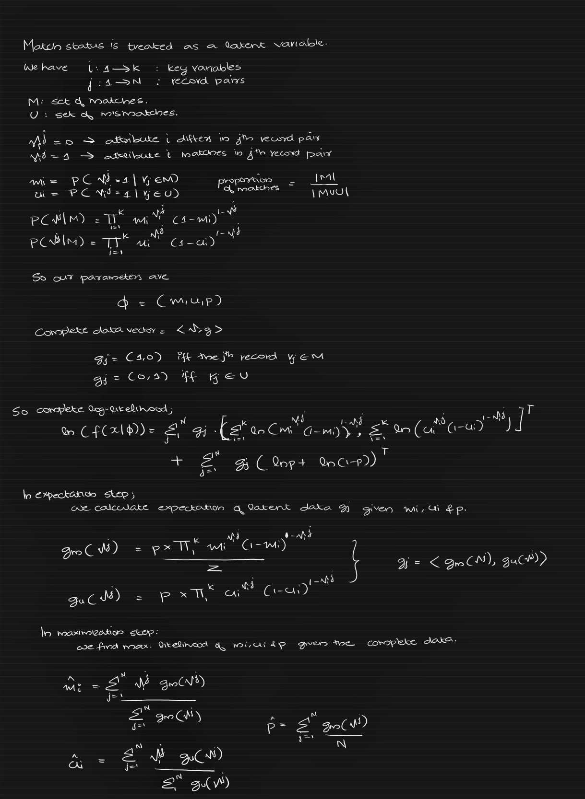

```
┏━━━┳━━━┳━━━┳━┓┏━┓
┃┏━━┫┏━┓┃┏━━┫┃┗┛┃┃
┃┗━━┫┗━━┫┗━━┫┏┓┏┓┃
┃┏━━┻━━┓┃┏━━┫┃┃┃┃┃
┃┃╋╋┃┗━┛┃┗━━┫┃┃┃┃┃
┗┛╋╋┗━━━┻━━━┻┛┗┛┗┛
```


# Fellegi Sunter Record Linkage - Expectation Maximization.

*Implementation of  Winkler's Expectation Maximization for Fellegi Sunter Record Linkage. *

* Calculate m,u and p values for FS
* Extendible with custom similarity functions


<p>


</p>

## Getting Started


### Prerequisites

| Package     | Version      |
|:----------------|:---------------|
| pandas| 1.1.4 |
| numpy| 1.18.5 |


### Installing

```powershell
pip install -r requirements.txt
```


### Data

Record Linkage Datasets.
<a href="" target="_blank">[Source]</a>


```powershell
/fs-em/data/RL1.csv
```


id|fname|lname|bm|bd
-----|-----|-----|-----|-----
A1|STEFAN|MUELLER|8|13
A2|OTTO|WERNER|4|12
A3|HEINZ|LEHMANN|9|25
A4|WERNER|KOERTIG|11|28
A5|PETEVR|FUCHS|9|12
A6|DIETER|WEISS|1|10
A7|JUERGEN|FRANKE|7|4
A8|JOERG|KELLER|6|26
A9|GERD|BAUERH|7|27
A10|THORSKTEN|MARTIN|11|15


```powershell
/fs-em/data/RL2.csv
```
id|fname|lname|bm|bd
-----|-----|-----|-----|-----
B1|WOLFGANG|LEHMANN|1|3
B2|MANFRED|HOFFMANN|8|25
B3|ANDRE|FISCHER|6|25
B4|KARL|HOFFMANN|10|21
B5|BERND|JUNG|1|14
B6|JOERG|KELLER|6|26
B7|ALEXANDER|MUELLER|9|9
B8|MICHAEL|SCHAEFER|5|30
B9|OTTO|WERNER|4|12
B10|DENNIS|SCHAEFER|4|11


## Running 

```python
# pre-process
pre = PreProcessRLData(source_dataframe=df_src, target_dataframe=df_target, key_column='id')
pairs = pre.generate_pairs(method='jaro', threshold=0.5)

print(pairs)
# print(pairs.fname.value_counts())

agreement_matrix = pairs.drop(labels=['M_ID', 'S_ID'], axis=1).to_numpy()
print(agreement_matrix)

# EM
fs_em = FellegiSunterEM(df_src, df_target)
res = fs_em.run_em(agreement_matrix, tolerance=0.001, max_iter=10000)

# print results
for attr, v in res.items():
    print(attr, '=>', v)
```

or

From the root directory run

```powershell
python main.py
```
this will execute 
```powershell
examples\RL_dataset.py
```


#### Output

```powershell
DS1:
id     fname     lname  bm  bd
0  B1  WOLFGANG   LEHMANN   1   3
1  B2   MANFRED  HOFFMANN   8  25
2  B3     ANDRE   FISCHER   6  25

DS2:
   id   fname    lname  bm  bd
0  A1  STEFAN  MUELLER   8  13
1  A2    OTTO   WERNER   4  12
2  A3   HEINZ  LEHMANN   9  25

********************************
Pairs:
      M_ID  S_ID  fname  lname   bm   bd
0       A1    B1    1.0    1.0  0.0  0.0
1       A2    B1    1.0    1.0  0.0  0.0
2       A3    B1    0.0    1.0  0.0  0.0
3       A4    B1    1.0    1.0  0.0  0.0
4       A5    B1    0.0    1.0  0.0  0.0
...    ...   ...    ...    ...  ...  ...
9995   A96  B100    1.0    1.0  0.0  0.0
9996   A97  B100    1.0    1.0  0.0  0.0
9997   A98  B100    0.0    0.0  0.0  0.0
9998   A99  B100    0.0    1.0  0.0  0.0
9999  A100  B100    0.0    0.0  0.0  0.0

[10000 rows x 6 columns]

Agreement Matrix:
[[1. 1. 0. 0.]
 [1. 1. 0. 0.]
 [0. 1. 0. 0.]
 ...
 [0. 0. 0. 0.]
 [0. 1. 0. 0.]
 [0. 0. 0. 0.]]
 
 
Directory created. logs

Iteration:  0
p : 0.39718280417183915
m : [0.97613927 0.96654118 0.1962686  0.09014925]
u : [0.7662261  0.67202208 0.0266175  0.00994376]
Iteration:  1
p : 0.38710020140712315
m : [0.96335913 0.9522206  0.1792591  0.08477575]
u : [0.77775109 0.68591182 0.04015137 0.01465703]
Iteration:  2
p : 0.38004013575697665
m : [0.95313602 0.94196736 0.16937691 0.08225496]
u : [0.78613163 0.69522984 0.04779338 0.0170008 ]
Iteration:  3
p : 0.3748604533754206
m : [0.94422574 0.93368783 0.16359465 0.08131242]
u : [0.79285835 0.70223898 0.05226807 0.01810666]
....
......
........
Iteration:  55
p : 0.3022833723137372
m : [0.85190363 0.80027631 0.26790131 0.13633725]
u : [8.48601961e-01 7.84114578e-01 1.86578444e-02 8.42054799e-04]

Run completed.

agree-score => [0.85190363 0.80027631 0.26790131 0.13633725]
disagree-score => [8.48601961e-01 7.84114578e-01 1.86578444e-02 8.42054799e-04]
prob => 0.3022833723137372
convergence-flag => 1
```


## Logs and Tracking

Parameter values of each run is captured under 
```powershell
\logs
```

```powershell
2022-01-20 00:32:34:INFO>>fsem:run_em: p:0.39718280417183915 m:[0.97613927 0.96654118 0.1962686  0.09014925] u:[0.7662261  0.67202208 0.0266175  0.00994376]
2022-01-20 00:32:34:INFO>>fsem:run_em: p:0.38710020140712315 m:[0.96335913 0.9522206  0.1792591  0.08477575] u:[0.77775109 0.68591182 0.04015137 0.01465703]
2022-01-20 00:32:34:INFO>>fsem:run_em: p:0.38004013575697665 m:[0.95313602 0.94196736 0.16937691 0.08225496] u:[0.78613163 0.69522984 0.04779338 0.0170008 ]
2022-01-20 00:32:34:INFO>>fsem:run_em: p:0.3748604533754206 m:[0.94422574 0.93368783 0.16359465 0.08131242] u:[0.79285835 0.70223898 0.05226807 0.01810666]
```

## EM - Model


## Similarity Measures
    * Jaro
    * Levenshtein

Checkout this dedicated lib for string similarity measures <a href="https://github.com/sajith-rahim/str-similar" target="_blank">here</a>

## Folder Structure
```powershell
|   LICENSE
|   main.py
|   README.md
|   requirements.txt
|
+---data
|       RL1.csv
|       RL2.csv
|
+---examples
|   |   RL_dataset.py
|   |
|   +---img
|   |       fsem_.png
|
+---fsem
|   |   __init__.py
|   |
|   +---algorithm
|   |   |   fsem.py
|   |   |   __init__.py
|   |
|   +---preprocessing
|   |   |   process.py
|   |   |   __init__.py
|   |
|   +---similarity_measures
|   |   |   jaro.py
|   |   |   levenshtein.py
|   |   |   __init__.py
|   |   |
|   |   +---utils
|   |   |       utils.py
|   |   |       __init__.py
|   |   
|   |
|   +---utils
|   |   |   logger.py
|   |   |   utils.py
|   |   |   __init__.py
|  
|  
|
\---logs
        em-20-1-2022.log
```

## Deployment

PYPI:  🚧 🅆🄾🅁🄺 🄸🄽 🄿🅁🄾🄶🅁🄴🅂🅂

## License

BSD 3-Clause License

## Future


 * Visualizations

## Acknowledgments

Jaro.py : 'Jean-Bernard Ratte - jean.bernard.ratte@unary.ca'
Levenshtein: modified from https://github.com/nap/jaro-winkler
